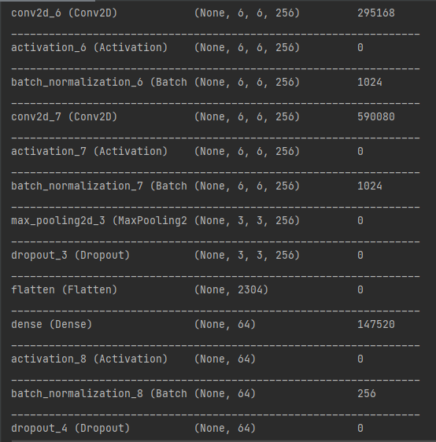

# Facial Expression Recognition


## Software

##### Pycharm


## Packages 

##### 1) Keras
##### 2) Tensorflow
##### 3) OpenCV
##### 4) Numpy


## Features

- Live Face Detection
- Live Face Expression Tracker


## To Run The Project

```bash
  Import the 'Training_Model.py', 'Face_Recognition.py', 'haarcascade_frontalface_default.xml', 'Train' & 'Validation' Folder into your Project Directory.
```
```bash
  Install all the Required Packages via the Python Interpreter Settings in PyCharm
```
```bash
  Open Training_Model.py and Run the File to generate the Emotion_Checkpoint.h5, which is basically a file which stores all the training data points which has the best 
  accuracy and least error after going through the specified number of training rounds.
```
```bash
  Now, Open the Face_Recognition.py and Run the File. Finally, a webcam will open and the program hopefully will be able to detect your facial expressions to its level best.
```

## NOTE (To Enable GPU when Training Datasets)

```bash
  To fasten the process of generating the Emotion_Checkpoint.h5, it is recommended to use the system GPU, if applicable.
```
```bash
  Install NVIDIA CUDA Toolkit and verify if the system has CUDA capable GPU.
```
```bash
  Next, install the Deep Neural Network library NVIDIA CuDNN using the guide provided below in 'Resources' section.
```
```bash
  Once, both CUDA and CuDNN are installed. Open Pycharm and Goto: File ---> Settings ---> Project Interpreter
```
```bash
  Next, Select the appropriate Environment which has TensorFlow-GPU installed and Select: Run ---> Edit Configuration ---> Environment Variables
```
```bash
  Finally, add the lib path as 'Some Name'_PATH 
```

## Training Sample Screenshots





## Demo


## Code Sample Screenshots


